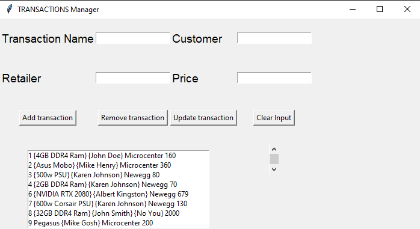

# Database Table Manager  

  

GUI form to modify database  

## Files
- [__db.py__](db.py)  
Generate table TRANSACTION in store.db with python3 (sqlite3)
- [__transaction_manager.py__](transaction_manager.py)  
Python3 form to modify data in store.db
- [__store.db__](store.db)  
Database file