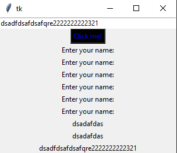
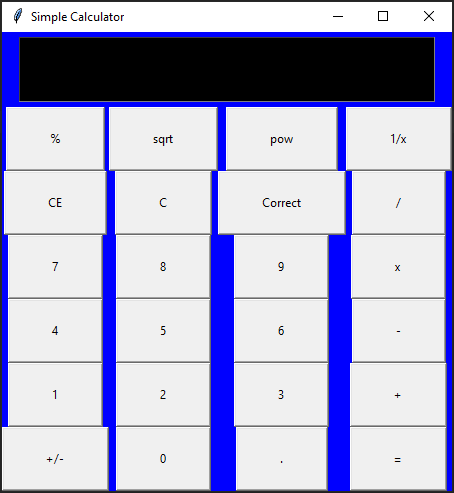

# python
Simple python3 scripts. Learning how to use git.

# Subdirectories
* /base
<br/> Base python code samples.

* /Tkinter
<br/> Simple Tkinter apps.  
[L] helloTkinter  [R] simple_calculator  
 

* /DB
<br/> Database with python  
Table manager  


<!--- Block comment
[//]: # (This is a comment, it will not be included)
I think you should use an
`<addr>` element here instead.

    function fancyAlert(arg) {
      if(arg) {
        $.facebox({div:'#foo'})
      }
    }

```javascript
function fancyAlert(arg) {
  if(arg) {
    $.facebox({div:'#foo'})
  }
}
```

)

-->
